# AGENTS.md

Instructions for an AI coding assistant (Claude Code, Codex, Copilot, Cursor,
Gemini CLI, Aider, …) that has just been handed this repository.

Read this file top to bottom before running anything. It is written so you can
take a user from a cold clone to a working script-writing skill without asking
them to figure anything out.

---

## 0. Fastest route: connect it as an MCP server

If your client speaks MCP, do this first — it turns the whole pipeline into
typed tools and you can skip the shell entirely.

```bash
claude mcp add framezero -- python3 "$(pwd)/bin/mcp_server.py"
```

Any other client, in its JSON config:

```json
{"mcpServers": {"framezero": {"command": "python3",
                              "args": ["/abs/path/to/bin/mcp_server.py"]}}}
```

Eight tools: `list_projects`, `profile_creator`, `findings`, `creator_report`,
`voice_profile`, `check_script`, `transcripts`, `run_pipeline`. Stdlib only, no
install. The rest of this file still applies — it is the reasoning behind the
tools, and sections 2, 7 and 8 in particular are not encoded in the schemas.

---

## 1. What this repository is

**framezero** studies a public Instagram creator's Reels and turns what it finds
into a reusable script-writing skill for *you*, the assistant.

It answers two separate questions, and keeping them separate is the whole design:

| question | stage | output | needs transcription? |
|---|---|---|---|
| **Who is this creator**, and are they worth studying? | `profile.py` | dossier: reach, trajectory, brand deals, CTAs, neighbours | no — ~1 min |
| What are their winning reels **about**, structurally? | `report.py` → `aggregate.py` | countable feature deltas, marked REPLICATED / SINGLE / CONTESTED / DEAD | yes |
| What does that creator **sound like**? | `voice.py` | 16 numeric dials with target bands, plus signature phrases | yes |

You are not an optional add-on to this pipeline. **You are the last stage.** The
Python writes measurements; you read them and write the skill. `prompts/extract.md`
and `prompts/emit.md` are your instructions for that stage — read them when you
get there, not before.

---

## 2. Ground rules (violating these breaks the project)

> [!IMPORTANT]
> These are not style preferences. Each one exists because breaking it already
> caused a real failure.

1. **Never commit anything under `data/`, `out/`, or `projects/*.json`.**
   `data/` is someone else's content. `projects/*.json` names real creators.
   `.gitignore` covers all three; only `projects/example.json` is tracked. Do not
   `git add -f` past it, and do not paste creator handles or verbatim transcript
   lines into commit messages, the README, or any tracked file.

2. **Never average two creators' voices.** Structure findings pool across
   creators — that is what makes them trustworthy. Voice does not. Averaging two
   voices produces a third person who does not exist. Write in one voice at a time.

3. **Never retry `/api/v1/feed/user/<id>/`.** Instagram gated it. It returns 401
   on the first request from a cold IP with the text *"Please wait a few minutes
   before you try again."* **That message is a lie** — it is the generic string for
   a retired surface, there is no cooldown, and backing off costs hours and never
   succeeds. `scrape.py` already uses the two GraphQL calls that do work.

   **Instagram returns that identical string for two different things**, and you
   cannot tell them apart from the response: a permanently retired surface, and a
   temporarily blocked one. `/api/v1/users/web_profile_info/` — the one call that
   still fetches follower count, bio, category and related accounts — now answers
   it too, IP-wide, for handles never touched. So:

   - **Never let it kill a run.** `scrape.py` falls back to
     `user_id_from_timeline()`, which lifts the user id and basic identity off
     the post timeline. Every downstream stage still works; only the identity
     block in the dossier is thinner.
   - **Do not build in a retry loop.** If it is the rollout, no wait clears it.
   - **Do offer `--refresh` later.** If it was a throttle, it comes back, and
     `--refresh` refills the missing fields.

4. **Only REPLICATED findings become rules.** A finding measured on one creator
   is that creator's habit, not a law of the format. Write it into a skill as a
   bet, labelled as one — never as a rule.

5. **Do not install skills into the user's agent config without asking.** Emit to
   `out/skills/` and let them review first.

6. **Standard library only.** No `pip install`. If you are tempted to add a
   dependency, you are solving the wrong problem.

---

## 3. Preflight

Run this first. It tells you exactly what is missing.

```bash
python3 - <<'PY'
import shutil, sys, pathlib
ok = True
print("python  ", sys.version.split()[0], "OK" if sys.version_info >= (3, 9) else "NEED >= 3.9")
for tool in ("ffmpeg", "whisper-cli"):
    p = shutil.which(tool)
    print(f"{tool:8}", p or "MISSING"); ok &= bool(p)
m = pathlib.Path.home() / ".whisper/models/ggml-large-v3-turbo.bin"
print("model   ", m if m.exists() else f"MISSING -> {m}"); ok &= m.exists()
print("\nready" if ok else "\nsee section 3 of AGENTS.md")
PY
```

Install whatever it reports missing:

<table>
<tr><th>macOS</th><th>Debian / Ubuntu</th></tr>
<tr valign="top"><td>

```bash
brew install ffmpeg whisper-cpp
```

</td><td>

```bash
sudo apt install -y ffmpeg build-essential cmake
git clone https://github.com/ggerganov/whisper.cpp /tmp/whisper.cpp
cmake -B /tmp/whisper.cpp/build -S /tmp/whisper.cpp
cmake --build /tmp/whisper.cpp/build -j --config Release
sudo cp /tmp/whisper.cpp/build/bin/whisper-cli /usr/local/bin/
```

</td></tr>
</table>

The model, on either platform (~1.6 GB, one time):

```bash
mkdir -p ~/.whisper/models
curl -L -o ~/.whisper/models/ggml-large-v3-turbo.bin \
  https://huggingface.co/ggerganov/whisper.cpp/resolve/main/ggml-large-v3-turbo.bin
```

No API keys. No accounts. No login. Nothing is sent anywhere except the
anonymous requests to Instagram's public GraphQL endpoint.

---

## 4. What to ask the user

You need four things before you can create a project. Ask for all of them in one
message; do not go one at a time.

| you need | example | why |
|---|---|---|
| **niche label** | `"AI, automation and workflow software"` | seeds the whisper prompt |
| **vocabulary** | `ChatGPT,Claude,n8n,Make.com,Zapier` | stops whisper writing "N8 N" and "make dot com" |
| **modes** | `informational`, `tech-demo`, `funny` | different crafts, studied separately |
| **creators per mode** | public handles they admire | 2+ per mode, or nothing can replicate |

> [!TIP]
> If the user names only one creator, tell them plainly: with one creator nothing
> can be marked REPLICATED, so every finding will come back as a bet. Two is the
> minimum for the tool to do its actual job. Run it anyway if they want — just
> make sure they know what they are getting.

Modes are the user's to name. Pooling a comedy account with a tutorial account
compares two different crafts and produces mush, so the pipeline keeps them
apart. Same creator can appear under more than one mode.

---

## 5. Start cheap: profile before you commit

A full run costs 20–60 minutes, almost all of it transcription. A dossier costs
one scrape:

```bash
./framezero profile <handle>
```

Writes `data/<handle>/profile.md`, `profile.json`, and `posts.csv` — identity,
bio, followers, median/best/worst plays, engagement, growth trajectory by
quarter, posting cadence, reel durations, hashtags, audio type, disclosed brand
partnerships and who sponsored them, the caption CTA they actually run, and
Instagram's own list of related accounts.

**Use it as a gate.** The dossier includes a section headed *"Is there anything
to learn here?"* — the ratio of the creator's top decile to their own median. If
that ratio is near 1, their winners are not doing anything different and the
expensive pass will produce nothing. Tell the user before spending the hour.

It is also the answer to "who else should I study": `neighbours` in
`profile.json` is Instagram's own related-accounts list for that handle.

Three limits to state plainly rather than paper over:

- **No follower history.** Instagram returns one number, today. The trajectory
  table is median plays per quarter, which is a proxy and moves with the
  algorithm as well as the audience. Never present it as follower growth.
- **Disclosed sponsorship only.** `paid_partnership` is the platform flag.
  Sponsor tags, recurring @mentions and caption CTAs catch more, never all.
- **Location only where tagged**, which is usually nowhere.

---

## 6. The run

```bash
./framezero new myproject \
    --niche "AI, automation and workflow software" \
    --vocabulary "ChatGPT,Claude,n8n,Make.com,Zapier,Cursor" \
    --mode informational=handle_a,handle_b \
    --mode tech-demo=handle_c

./framezero run myproject          # 20-60 min for two creators, mostly transcription
./framezero show myproject         # progress at any time
```

`run` is **idempotent** — every stage skips work already on disk. If it dies
halfway, run it again. To force a re-pull for one creator, delete
`data/<handle>/index.json`.

Useful narrowing: `--mode informational`, `--only handle_a`, `--top 15 --bottom 15`.

Stages, in order, all runnable alone:

```mermaid
flowchart LR
  A[scrape.py<br/><sub>index + play counts</sub>] --> B[rank.py<br/><sub>outlier score</sub>]
  B --> C[fetch.py<br/><sub>mp4 to 16kHz wav</sub>]
  C --> D[listen.py<br/><sub>whisper.cpp</sub>]
  D --> E[corpus.py<br/><sub>one markdown</sub>]
  E --> F[report.py<br/><sub>countable deltas</sub>]
  F --> P[profile.py<br/><sub>account dossier</sub>]
  P --> G[voice.py<br/><sub>16 dials</sub>]
  G --> H[aggregate.py<br/><sub>what replicates</sub>]
  H --> I([you<br/><sub>write the skill</sub>])
```



Two ordering constraints you must not "optimise" away:

- `voice.py` runs **after every creator**, never inside the per-creator loop. A
  signature phrase is one this creator uses *and the others do not*, so it cannot
  be computed until the others exist.
- `report.py` runs **before** you read any transcript. An agent reading
  transcripts will find patterns whether or not they are there. Measure first,
  then read.

---

## 7. Read the outputs in this order

```
data/_projects/<project>/<mode>.md   ← START HERE. What replicated across creators.
data/<handle>/profile.md             ← who they are, what they post, how they earn
data/<handle>/report.md              ← that creator's countable deltas
data/<handle>/voice.md               ← how they sound: dials + signature phrases
data/<handle>/corpus.md              ← the transcripts themselves (read LAST)
prompts/extract.md                   ← how to turn the above into a skill
prompts/emit.md                      ← how the skill must be written
```

Then emit one skill **per mode** (not per creator) into `out/skills/`, plus a
separate voice layer. Structure and voice stay in separate files on purpose:
copying structure is learning a craft, copying voice makes a knockoff of someone
who already has the audience.

---

## 8. Closing the loop on every draft

This is the part assistants skip, and skipping it is why generated scripts read
like an essay in the shape of a reel. **Every draft gets checked before you show
it to the user.**

```bash
./framezero check draft.txt --like handle_a --wpm 176
```

```
runtime at 176.0 wpm: 55s   their winners ran 23–57s   ok
dial                         script          target  verdict
second person /100w            6.17     4.26 – 7.77  ok
words per sentence             13.5     12.9 – 20.5  ok
long sentences (>20w) %        8.33     9.11 – 52.0  LOW  ↑ raise
numbers /100w                  4.94     0.24 – 4.13  HIGH ↓ lower
...
2 of 16 dials off. Worst first:
  HIGH  numbers /100w   (20% outside)
```

Rules for using it:

- **`--wpm` is the writer's own pace, not the creator's.** Default is 210, which
  is the studied creators' median and is faster than most people speak. Have the
  user time themselves reading 200 words aloud; `wpm = words / minutes`. Getting
  this wrong makes every script about 20% too long.
- **Fix a failing dial by rewriting the beat, not by tuning tokens.** If runtime
  is over, cut a whole beat — do not shave adjectives.
- A dial is a **band, not a point.** Land inside it; do not chase the mean.
- `--like a,b` pools bands across handles. Use it only to widen a target range,
  never as a licence to blend two voices in the prose.

---

## 9. Troubleshooting

| symptom | cause | fix |
|---|---|---|
| `scrape.py` returns 0 posts | `doc_id` rotated (happens every 2–4 weeks) | It self-heals — it scrapes the current id out of Instagram's JS bundle. Re-run once. |
| 401 on `/api/v1/feed/user/` | the retired REST timeline | Do not back off. See ground rule 3. |
| `profile endpoint unavailable (401) — falling back to the timeline` | `web_profile_info` is gated or throttled for your IP | **Nothing is broken.** The run continues; the dossier says which identity fields are missing. Retry with `--refresh` later. |
| Transcripts are all lowercase, no punctuation | whisper ran without a seed prompt | Pass `--project <name>` to `listen.py`. This is not optional. |
| Whisper writes "N8 N", "make dot com", "cloud" | niche vocabulary missing from the project | Add the terms to `vocabulary`, delete the bad transcripts, re-run `listen.py`. |
| Every finding says SINGLE | only one creator in that mode | Add a second creator. This is the tool working correctly. |
| `voice.py profile` refuses | fewer than 3 transcribed winners | Raise `--top`, or the creator does not have enough catalogue. |
| `profile.md` has no brand deals, audio or tags | index predates those fields | `./framezero profile <handle> --refresh` |
| Dossier says the spread is flat | the account genuinely has no winner/control delta | Say so before spending an hour transcribing it. |
| Ranking looks wrong for a creator who pivoted | old reels poisoning the baseline | Give that creator their own cutoff: `"creators": {"handle": {"since": "2025-06-01"}}` |

---

## 10. Repository map

```
framezero              CLI entry point — new / run / show / voice / check
bin/scrape.py          public GraphQL index + real play counts
bin/rank.py            outlier score vs a ±90-day rolling median
bin/fetch.py           mp4 download, ffmpeg to 16kHz mono wav
bin/listen.py          whisper.cpp, seeded with the niche vocabulary
bin/corpus.py          ranking + transcripts into one markdown file
bin/report.py          countable winner/control deltas, per creator
bin/profile.py         whole-account dossier: md + json + csv, no transcription
bin/voice.py           16 voice dials, signature phrases, draft scoring
bin/mcp_server.py      the same pipeline as MCP tools, over stdio
bin/aggregate.py       pools creators, assigns replication verdicts
bin/project.py         project config, niche lexicon derivation
prompts/extract.md     how to read the outputs
prompts/emit.md        how to write the skills
projects/example.json  placeholder config — copy this shape
```

---

## 11. Definition of done

Before you tell the user you are finished:

- [ ] `./framezero show <project>` lists every creator with a transcript count > 0
- [ ] `data/_projects/<project>/<mode>.md` exists for every mode and has verdicts
- [ ] every creator has a `profile.md` and a `voice.md` with 16 dials
- [ ] `out/skills/` has one skill per mode, plus a voice layer
- [ ] every rule in a skill traces to a REPLICATED finding; bets are labelled as bets
- [ ] any sample script you wrote passes `./framezero check` at the user's own wpm
- [ ] `git status` is clean of `data/`, `out/`, and real `projects/*.json`
