<div align="center">


<p>
  
  
  
  
  
</p>

<h3>Find out what actually works on a creator's Reels — then write in their voice.</h3>

<p>
Point it at a public handle. It pulls every reel with real play counts, scores each one<br>
against that creator's own baseline, transcribes the outliers locally, measures what<br>
separates the winners from the flops, and hands your AI agent a skill that writes like them.
</p>

<p>
  <b><a href="#-quickstart">Quickstart</a></b> ·
  <b><a href="#-what-616-reels-actually-showed">The findings</a></b> ·
  <b><a href="#-sounding-like-them">Voice</a></b> ·
  <b><a href="AGENTS.md">For AI assistants</a></b> ·
  <b><a href="#-how-it-gets-the-data">How the scraping works</a></b>
</p>

<p><sub>No login · No cookies · No paid scraping service · No transcription API<br>
Runs on your machine for the cost of electricity.</sub></p>

</div>

---

## 🎯 The gap this fills

Everyone writing for social media has a creator they wish they sounded like.

The market splits in two and nothing bridges it. Some tools **find** a creator's
best reels — they sort by views. Others **explain** one reel — hook, pacing,
structure. The ones claiming to do both and "write in your competitor's voice"
are, on inspection, generic models over a generic viral corpus. The output is not
grounded in that specific creator's transcripts at all.

framezero does the grounding. Three things follow from that, and no other tool
does any of them:

<table>
<tr>
<td width="33%" valign="top">

### 📈 Outlier score, not views

Every reel is scored against the median of its own neighbours in a **±90 day
window**.

A 100K-view reel from when they had 20K followers is a far bigger signal than a
100K-view reel today. Sorting by raw views — all the paid tools do — mostly
surfaces recent work.

</td>
<td width="33%" valign="top">

### ⚖️ Controls, not just winners

It transcribes the **worst** performers alongside the best.

Studying only winners is survivorship bias: you learn what all their videos do,
not what the winning ones do *differently*. The delta is the whole point. No SaaS
does this — it doubles their transcription bill.

</td>
<td width="33%" valign="top">

### 🎙️ Voice as numbers

16 measured dials — who sentences address, how long they run, which phrases
recur — each with a **target band**.

"Sound like them" stops being an instruction to vibe and becomes a target you can
fail and fix.

</td>
</tr>
</table>

---

## ⚡ Quickstart

<details open>
<summary><b>1 · Install</b></summary>

<br>

```bash
# macOS
brew install ffmpeg whisper-cpp

# the model, once — ~1.6 GB
mkdir -p ~/.whisper/models
curl -L -o ~/.whisper/models/ggml-large-v3-turbo.bin \
  https://huggingface.co/ggerganov/whisper.cpp/resolve/main/ggml-large-v3-turbo.bin
```

Python 3.9+, standard library only. **No `pip install`. No API keys. No account.**

<sub>Linux: `apt install ffmpeg` and build <a href="https://github.com/ggerganov/whisper.cpp">whisper.cpp</a> from source — full commands in <a href="AGENTS.md#3-preflight">AGENTS.md</a>.</sub>

</details>

<details open>
<summary><b>2 · Describe your niche and whose work you want to learn from</b></summary>

<br>

```bash
./framezero new myproject \
    --niche "AI, automation and workflow software" \
    --vocabulary "ChatGPT,Claude,n8n,Make.com,Zapier,Cursor" \
    --mode informational=creator_a,creator_b \
    --mode tech-demo=creator_c \
    --mode funny=creator_d,creator_e
```

**Modes are yours to name.** informational, teaching, tech-demo, funny,
storytime, reviews — whatever divisions your niche actually has. Creators map to
the mode you study them *for*, and the same creator can appear under more than
one. Pooling a comedy account with a tutorial account compares two different
crafts, so the pipeline keeps them apart.

> [!TIP]
> **Give every mode at least two creators.** With one, nothing can replicate, and
> every finding comes back as a bet rather than a rule.

</details>

<details open>
<summary><b>3 · Run it</b></summary>

<br>

```bash
./framezero run myproject       # safe to repeat; every stage skips work already on disk
./framezero show myproject      # progress, any time
```

```console
$ ./framezero show myproject
project: myproject   niche: AI, automation and workflow software
  vocabulary: ChatGPT, Claude, Claude Code, Gemini, n8n, Make.com, Zapier …

  informational:
    - creator_a (227 reels, 33 transcribed)
    - creator_b (395 reels, 48 transcribed)
  tech-demo:
    - creator_b (395 reels, 48 transcribed)
```

Narrow it with `--mode funny`, `--only handle`, `--top 15 --bottom 15`.

</details>

<details open>
<summary><b>4 · Hand the outputs to your agent</b></summary>

<br>

```
data/_projects/<project>/<mode>.md   ← START HERE — which findings REPLICATE
data/<handle>/report.md              ← that creator's countable deltas (structure)
data/<handle>/voice.md               ← how they SOUND — dials + signature phrases
data/<handle>/corpus.md              ← the transcripts themselves (read LAST)
prompts/extract.md, prompts/emit.md  ← how to turn all that into skills
```

Your agent writes one skill **per mode** into `out/skills/`. There is a whole
file — [`AGENTS.md`](AGENTS.md) — written for it.

</details>

<details open>
<summary><b>5 · Check every draft before you record it</b></summary>

<br>

```bash
./framezero check draft.txt --like creator_b --wpm 176
```

```console
voice check — draft.txt  vs  @creator_b
runtime at 176.0 wpm: 55s   their winners ran 23–57s   ok
dial                         script          target  verdict
--------------------------------------------------------------------
second person /100w            6.17     4.26 – 7.77  ok
first person sing /100w        1.23     0.47 – 2.24  ok
words per sentence             13.5     12.9 – 20.5  ok
short sentences (<8w) %        8.33     2.52 – 31.4  ok
long sentences (>20w) %        8.33     9.11 – 52.0  LOW  ↑ raise
contractions /100w             3.09     2.36 – 4.65  ok
numbers /100w                  4.94     0.24 – 4.13  HIGH ↓ lower
--------------------------------------------------------------------
2 of 16 dials off. Worst first:
  HIGH  numbers /100w   (20% outside)
  LOW   long sentences (>20w) %   (9% outside)
```

> [!IMPORTANT]
> **`--wpm` is *your* speaking rate, not the creator's.** The default 210 is the
> studied creators' median and is faster than most people talk. Time yourself
> reading 200 words aloud: `wpm = words ÷ minutes`. Get this wrong and every
> script runs about 20% long.

</details>

---

## 🔬 What 616 reels actually showed

Run against two creators in the same niche — **221 and 395 reels**, each split
into winners and controls against their own contemporaneous baseline. Worth
reading before you trust anything you have been told about short-form.

<table>
<tr><td>

### ✅ A number in the first two sentences — REPLICATED

**60% of winners vs 21% of controls** for one creator. **58% vs 25%** for the
other. Two different formats, two different audiences, near-identical split. The
most reliable finding in the dataset.

</td></tr>
<tr><td>

### ❌ Length is not a lever — DEAD

Correlation between duration and performance: **−0.058** across 221 reels and
**−0.006** across 395. Every quartile of one creator's ranking had a median
duration of 47–49 seconds. And the two creators' tails point in *opposite*
directions — one's winners are shorter than her controls, the other's are longer.

That is what noise looks like. Every "keep it under N seconds" rule you have read
is unsupported here.

</td></tr>
<tr><td>

### 🎲 The named subject carries the reel — SINGLE (one creator's bet)

One creator's winners named **1.67** already-famous entities in their opening two
sentences; his controls named **0.58**. The scripts are structurally identical —
same format, same CTA, same delivery, similar length. A **3.2M-play** reel and a
**7.7K-play** reel from the same creator, written the same way, differed mainly
in whether the subject was a household-name tool or an unknown one.

The matching negative: openers that withhold the subject and refer to it only as
an unnamed category ran **8% of winners and 41% of controls**.

</td></tr>
<tr><td>

### ⚠️ Small samples lie confidently

The first pass here used **6 reels** and produced a clean, plausible, completely
false rule about length, with zero overlap between cohorts. Scaling to the full
catalogue destroyed it — and re-baselining revealed that the reel that pass had
called the best performer was actually running at **0.818×**, *below* the
creator's median. Six reels had it studying an underperformer.

**This is the entire argument for scraping the catalogue rather than eyeballing a
handful.**

</td></tr>
</table>

`aggregate.py` decides this for you. It pools every creator studied for a mode
and marks each feature:

| verdict | meaning | what to do with it |
|:--|:--|:--|
| **REPLICATED** | same direction, real gap, 2+ creators | write it into the skill as a rule |
| **SINGLE** | one creator's habit | write it in as a bet, labelled as one |
| **CONTESTED** | creators disagree | leave it out |
| **DEAD** | no gap | leave it out, and stop repeating it |

**One finding did not replicate**, and the tool could only tell because it ran
twice: interview framing (an off-camera voice asks, the creator answers) split
5-of-15 winners against 0-of-15 controls for one creator, and appeared nowhere at
all in the other's catalogue. A real edge for her — not a law of the format.
Anything measured on a single creator is a bet.

---

## 🎙️ Sounding like them

`report.py` measures what a reel is **about**. That is structure, and structure is
only half of why a script feels like a particular person.

The other half is voice: who the sentences are addressed to, how long they run,
which words recur, how one beat hands off to the next. `voice.py` measures it the
same way — mechanically, from that creator's own winning transcripts.

```console
$ ./framezero voice creator_b
```

```
## Dials

| dial                     | target band    | their range  |
|--------------------------|----------------|--------------|
| second person /100w      | 4.26 – 7.77    | 3.70 – 9.40  |
| first person sing /100w  | 0.47 – 2.24    | 0.47 – 4.76  |
| words per sentence       | 12.9 – 20.5    | 9.64 – 23.4  |
| contractions /100w       | 2.36 – 4.65    | 1.01 – 5.05  |
| long words (8+ch) %      | 7.57 – 12.1    | 4.76 – 13.7  |
| … 11 more                |                |              |

## Signature phrases
Phrases they reach for and the other creators in this project do not.

| phrase          | uses | lift  |
|-----------------|------|-------|
| just comment    |  12  | 15.0× |
| completely free |   6  |  7.5× |
| down below and  |   5  |  6.3× |
```

Three things that make this work:

- **A voice is a region, not a point.** Bands are mean ± 1sd, clamped to what was
  actually observed. Land inside the band; do not chase the mean.
- **Signature phrases are relative.** A phrase counts only if this creator uses it
  *and the others in your project do not* — which is why voice profiling runs
  after every creator has been scraped, never inside the loop.
- **Structure pools across creators. Voice must not.** Averaging two voices
  produces a third person who does not exist. `--like a,b` widens a target range;
  it is not a licence to blend two people in the prose.

---

## 🧩 The pipeline

```mermaid
flowchart LR
  A["scrape.py<br/><small>index + real play counts</small>"] --> B["rank.py<br/><small>outlier score</small>"]
  B --> C["fetch.py<br/><small>mp4 → 16kHz wav</small>"]
  C --> D["listen.py<br/><small>whisper.cpp, seeded</small>"]
  D --> E["corpus.py<br/><small>one markdown</small>"]
  E --> F["report.py<br/><small>countable deltas</small>"]
  F --> G["voice.py<br/><small>16 dials</small>"]
  G --> H["aggregate.py<br/><small>what replicates</small>"]
  H --> I(["your agent<br/><small>writes the skill</small>"])
```



Every stage writes to disk and reads the previous stage's output, so any stage
reruns on its own. `scrape.py` resumes from whatever is already there.

```bash
python3 bin/scrape.py    <handle>                  # post index + play counts
python3 bin/rank.py      <handle> [--since D]      # outlier scoring
python3 bin/fetch.py     <handle>                  # download + 16kHz audio
python3 bin/listen.py    <handle> --project P      # local transcription
python3 bin/corpus.py    <handle>                  # one markdown corpus
python3 bin/report.py    <handle> --project P      # countable deltas
python3 bin/voice.py     profile <handle>          # voice fingerprint
python3 bin/aggregate.py <project> <mode>          # what replicates
```

**`report.py` matters more than it looks.** An agent reading transcripts will find
patterns whether or not they are there, so the countable features get measured
*before* the qualitative pass starts — each marked strong, weak or dead by the
size of the cohort split, with whole-catalogue correlations run separately to kill
findings that only look real at the tails. On its first run it caught two errors
in a careful hand analysis of the same data.

<details>
<summary><b>Flags worth knowing</b></summary>

<br>

| flag | stage | why |
|---|---|---|
| `--delay 30` | scrape | seconds between pages; 2 is plenty on this path |
| `--top 15 --bottom 15` | rank | size of the winner and control cohorts |
| `--window 90` | rank | baseline window in days — shrink it for creators who grew fast |
| `--keep-mp4` | fetch | keep the video, not just the audio |
| `--since 2025-06-01` | rank | ignore everything before a pivot |
| `--wpm 176` | check | **your** speaking rate |
| `--like a,b` | check | pool bands across handles |

If one creator changed niche and their older reels would poison the baseline,
give *that creator* their own cutoff rather than the whole project:

```json
"creators": { "somehandle": { "since": "2025-06-01" } }
```

</details>

<details>
<summary><b>Nothing is hardcoded to one niche</b></summary>

<br>

Three things used to be, and all three now come from the project config:

- **The whisper seed.** whisper.cpp emits all-lowercase, unpunctuated text without
  an initial prompt. framezero seeds one, built from your niche's vocabulary — so
  it fixes the casing *and* stops it writing "N8 N", "make dot com", and "cloud"
  when it means Claude. One flag, two wins.
- **The famous-entity lexicon.** Derived from your own scraped captions: proper
  nouns that recur broadly across the niche's biggest accounts. It filters
  sentence-initial capitals, drops words that also appear lowercase, and discards
  anything appearing in more than a third of posts — a term in every caption is
  that niche's boilerplate, not a household name.
- **The modes.** Yours to define.

</details>

---

## 🕸️ How it gets the data

<details>
<summary><b>Instagram gated the obvious route. Here is what actually works.</b></summary>

<br>

The old REST timeline (`/api/v1/feed/user/`) now answers **401 on the very first
request from a cold IP**:

```json
{"message":"Please wait a few minutes before you try again.",
 "require_login":true,"igweb_rollout":true}
```

> [!WARNING]
> **That message is a lie.** It is not a throttle and no cooldown clears it — it is
> the generic string Instagram returns for a retired or gated surface. Backing off
> and retrying is the trap; it costs hours and never succeeds. The same is true of
> the legacy `query_hash` route and the older `doc_id`s that instaloader and
> gallery-dl still ship.

What works anonymously is **two GraphQL calls joined on `code`**:

| call | gives you | missing |
|---|---|---|
| `PolarisProfilePostsQuery` | captions, timestamps, likes, comments, `video_versions[]` CDN URLs, DASH manifest | `view_count` is always null logged-out |
| clips user connection | real `play_count` per reel | no video URLs, no timestamps |

Duration is not returned at all any more, so framezero parses
`mediaPresentationDuration` out of the DASH manifest that ships with each post.
Same number, no extra request.

**The only header that matters is the CSRF pair.** Fetch the profile page, keep
the `csrftoken` cookie, echo it back as `X-CSRFToken`. The cookie alone is
rejected with a 403. A browser User-Agent, `X-ASBD-ID`, `Referer` and `Sec-Fetch-*`
are all cargo cult on this endpoint — though `X-IG-App-ID` *is* required for the
one REST call that resolves the user id.

Two seconds between pages is plenty; there is no meaningful rate limit on this
path. A 370-post profile takes about a minute.

**`doc_id`s rotate every two to four weeks.** When one stops working, framezero
scrapes the current value out of Instagram's own JS bundle rather than failing.
That is why this keeps working when the libraries above do not.

</details>

---

## 📦 What comes out

Your agent writes skills into your own agent config — for Claude Code that is
`~/.claude/skills/<name>/`, one directory per content mode:

```
informational-reel-script/   SKILL.md + swipe-file.md
teaching-reel-script/        SKILL.md + swipe-file.md
tech-demo-reel-script/       SKILL.md + swipe-file.md
reel-voice-layers/           SKILL.md
```

Split by **mode**, not by creator. A news reel, a how-to and a screen recording
are three different crafts with different beat structures, and one skill trying to
cover all three writes mush. The sibling descriptions have to disambiguate each
other explicitly or the agent picks between them at random.

Swipe files quote real transcripts, so they stay local and out of git along with
everything else under `data/`.

---

## 🤝 Scope and etiquette

This reads **public** profile data while logged out — the same data any visitor
sees. It does not log in, does not use anyone's cookies, and does not touch
private accounts. It derives structural patterns for your own writing; it is not
for republishing anyone's content.

`data/`, `out/` and real `projects/*.json` are gitignored, so scraped material and
the handles you study never land in a commit.

Borrowed voice is scaffolding. Use it until you have enough of your own reels to
measure — then point framezero at yourself.

---

<div align="center">

**MIT.** Free forever. Fork it, break it, make it yours.

<sub>Built because the gap was real and nobody had filled it.</sub>

</div>
